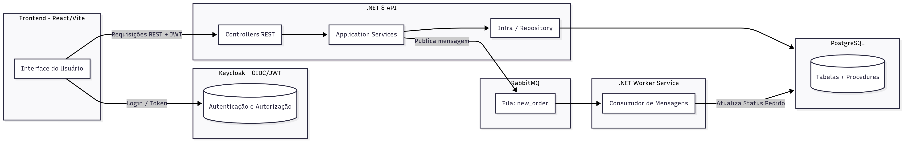

# **Valid - Teste Técnico**

Este repositório contém a POC do teste técnico utilizando **.NET 8**, **PostgreSQL**, **RabbitMQ**, **Keycloak (OIDC)** e **React**.

---

##  Stack Utilizada
- **.NET 8** — API REST + Worker  
- **PostgreSQL 15** — com *stored procedures*  
- **RabbitMQ** — mensageria  
- **Keycloak** — autenticação via OIDC/JWT  
- **React + Vite** — frontend  
- **Docker Compose** — orquestração  
- **GitHub Actions** — CI/CD  

---

##  Estrutura do Projeto

O projeto foi estruturado com o mínimo necessário para garantir boas práticas e funcionamento adequado.  
O GitHub Actions está configurado para executar testes e aplicar *lint* automaticamente.  
Também foi adicionado um *pre-commit hook*, que executa os testes e o *lint* antes de cada commit.

> **(Inserir diagrama de comunicação entre os serviços aqui)**

---

##  Arquitetura (ADR)

### **API**
 [src/Api](https://github.com/DanielCSilveira/test-valid/tree/main/src/Api)  
Camada de apresentação do backend, com as APIs REST.  
Contém endpoints simplificados para **Clientes (Customers)** e **Pedidos (Orders)**.  
O cliente contém apenas informações básicas de identificação, e o pedido é representado de forma plana (sem itens).  

---

### **Application**
 [src/Application](https://github.com/DanielCSilveira/test-valid/tree/main/src/Application)  
Camada de negócio (*business layer*).  
Contém regras simples de validação e lógica de domínio.  

Exemplo:  
- [CustomerService.cs](https://github.com/DanielCSilveira/test-valid/blob/main/src/Application/Services/CustomerService.cs) — validações de cliente  
- [OrderService.cs](https://github.com/DanielCSilveira/test-valid/blob/main/src/Application/Services/OrderService.cs) — envia mensagem para a fila ao inserir novo pedido  

---

### **Infra**
 [src/Infra](https://github.com/DanielCSilveira/test-valid/tree/main/src/Infra)  
Camada de acesso a dados, utilizando ORM e *stored procedures*.  

Exemplo:  
- [OrderRepository.cs](https://github.com/DanielCSilveira/test-valid/blob/main/src/Infra/Repository/OrderRepository.cs)

---

### **Worker**
 [src/Worker](https://github.com/DanielCSilveira/test-valid/tree/main/src/Worker)  
Serviço *Worker* responsável por consumir mensagens do RabbitMQ.  
Na POC, há um *worker* por fila — cada tipo de mensagem possui sua própria fila.  
Atualmente, o *worker* apenas atualiza o status do pedido para **PENDING**, mas poderia evoluir para gerar ordens de produção, por exemplo.  

---

### **Tests**
 [src/teste](https://github.com/DanielCSilveira/test-valid/tree/main/src/teste)  
Cada projeto possui seu respectivo conjunto de testes, além de um projeto de integração.  
Os testes foram implementados apenas para demonstração (*POC*), sem foco em cobertura total.  
Poderiam ser adicionadas métricas de cobertura, ferramentas de análise estática e validações automáticas no GitHub Actions.  

---

### **Front**
 [valid-front](https://github.com/DanielCSilveira/test-valid/tree/main/valid-front)  
Aplicação criada do zero com **React + Vite**, já integrada ao **Keycloak** para autenticação.  
Implementa um CRUD básico de Clientes e Pedidos.  
A estrutura é simples, apenas com *router* e *services*, sem modularização avançada.  

---

##  Setup

Assumindo que nomes, usuários e portas padrão não serão alterados:

1. Execute o comando:
   ```bash
   docker-compose up -d
   ```
2. Serão criados os seguintes containers:
   - **RabbitMQ**
   - **Keycloak**
   - **PostgreSQL**

---

###  Keycloak Setup

#### 1. Crie um novo Realm:
> **Nome:** `valid`

#### 2. Crie o cliente da API:
> **Client ID:** `valid-api`

No menu **Clients > valid-api > Client Scopes > valid_api_dedicated**, adicione um mapper com as seguintes configurações:

| Campo | Valor |
|-------|--------|
| **Name** | Valid Client Audience |
| **Mapper Type** | Audience |
| **Included Client Audience** | valid-api |
| **Add to Access Token** | ON |
| **Add to ID Token** | ON |

#### 3. Crie o cliente do Front:
> **Client ID:** `valid-front`

Adicione o `valid-api` como *audience* também.

**Configurações de acesso:**

| Campo | Valor |
|--------|--------|
| **Root URL** | http://localhost:5173/ |
| **Home URL** | http://localhost:5173 |
| **Valid Redirect URIs** | http://localhost:5173 |
| **Valid Post Logout Redirect URIs** | http://localhost:5173 |
| **Web Origins** | http://localhost:5173 |
| **Admin URL** | http://localhost:5173/ |

---

###  PostgreSQL
O banco será criado automaticamente com as duas tabelas principais, procedure  e uma massa de dados inicial (*seed*) para testes.
